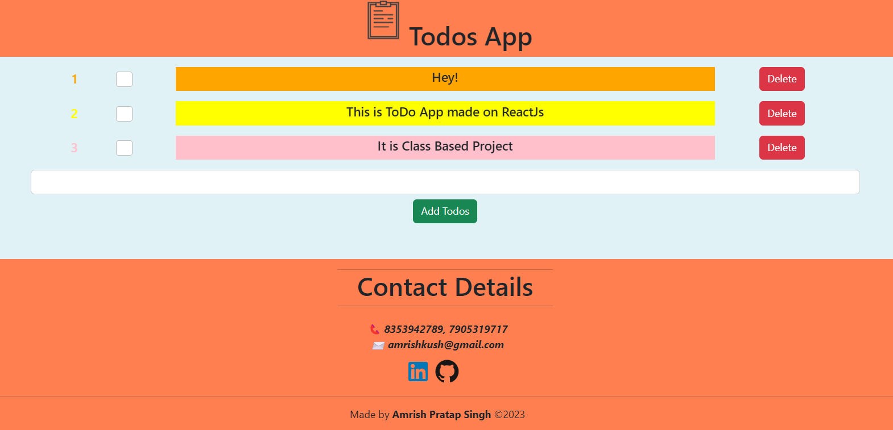

# Todo App

This project is a Todo App built with React. This is only frontend project based on classes.

##  About Me
###  Hi, I'm Amrish! 👋
#### I'm a full stack developer[MERN]...

    

## Features

- Add todos
- Every todo alloted random color
- Delete todos

## Technologies Used

- React.js

## Screenshot

## Demo

Click to Visit!
[TodoApp](https://todoapp.amrishpratapsingh.com)
